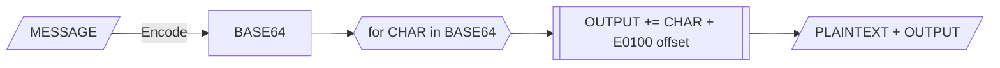

# unch 😗

[](https://github.com/dwisiswant0/unch/actions/workflows/tests.yaml)
[](http://pkg.go.dev/github.com/dwisiswant0/unch/pkg/unch)

Hides message with invisible **Un**icode **ch**aracters.

**unch** lets you hide one string in another string by using VARIATION SELECTOR-17 (`E0100`) through VARIATION SELECTOR-25 (`E01EF`). It enables encoding of strings that contain characters beyond the standard ASCII range.



<details open>
	<summary>
		<h3>Table of Contents</h3>
	</summary>

* [Installation](#installation)
  * [Binary](#binary)
  * [Source](#source)
  * [Docker](#docker)
* [Usage](#usage)
  * [Options](#options)
* [Examples](#examples)
  * [Encoding](#encoding)
    * [From STDIN](#from-stdin)
    * [From a FILE](#from-a-file)
    * [With _lorem ipsum_](#with-lorem-ipsum)
    * [Excluding trailing newline](#excluding-trailing-newline)
  * [Decoding](#decoding)
    * [From STDIN](#from-stdin-1)
    * [From a FILE](#from-a-file-1)
  * [Library](#library)
* [License](#license)
</details>

## Installation

### Binary

Simply, download a pre-built binary from [releases page](https://github.com/dwisiswant0/unch/releases). Verify and run!

### Source

Using [Go](https://golang.org/doc/install) compiler:

> [!NOTE]
> Go version **1.22.0+** must be installed and configured.

```bash
go install -v github.com/dwisiswant0/unch@latest
```

**— or**

Manual building executable:

> [!WARNING]
> The `master` branch contains the latest code changes and updates, which might not have undergone thorough testing and quality assurance - thus, you may encounter instability or unexpected behavior.

```bash
git clone https://github.com/dwisiswant0/unch.git
cd unch/
# git checkout [VERSION]
make build
# ./bin/unch --help
```

### Docker

Pull the Docker image by running:

```bash
docker pull ghcr.io/dwisiswant0/unch:latest
```

## Usage

Simply, **unch** can be run with:

```bash
unch "MESSAGE" "PLAINTEXT"
```

To decode:

```bash
unch -d "ENCODED"
```

### Options

Here are all the options it supports.

|    **Flag**    |               **Description**              |
| -------------- | ------------------------------------------ |
| `-d`/`-decode` | Decodes the encoded MESSAGE                |
| `-l`/`-lorem`  | Generate random PLAINTEXT with lorem ipsum |
| `-n`           | Do not output the trailing newline         |

## Examples

These are some examples of usage.

### Encoding

```bash
unch "MESSAGE" "PLAINTEXT"
```

#### From STDIN

```bash
unch "PLAINTEXT" <<< "MESSAGE"
```

#### From a FILE

```bash
unch "PLAINTEXT" < MESSAGE.txt
```

#### With _lorem ipsum_

```bash
unch -l "MESSAGE"
# or
unch -l <<< "MESSAGE"
```

#### Excluding trailing newline

```bash
unch -n "MESSAGE" "PLAINTEXT" > ENCODED.txt
```

### Decoding

```bash
unch -d "ENCODED"
```

#### From STDIN

```bash
unch -d <<< "ENCODED"
```

#### From a FILE

```bash
unch -d < ENCODED.txt > DECODED.txt
```

### Library

See the [`examples/main.go`](/examples/main.go) file for detailed implementation within the library.

## License

**unch** is released with ♡ by **@dwisiswant0** under the Apache 2.0 license. See [`LICENSE`](/LICENSE).